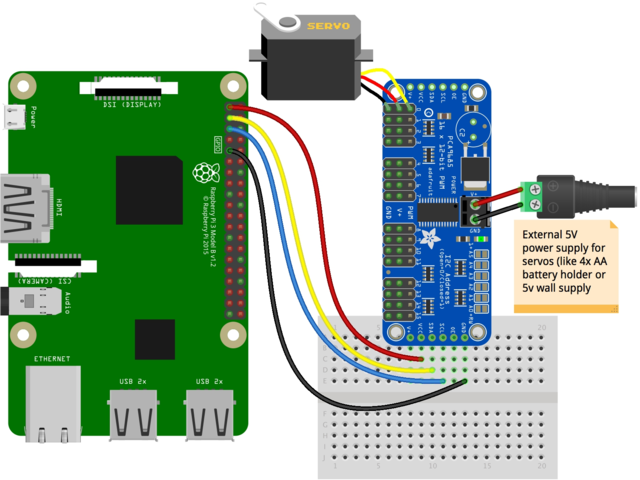
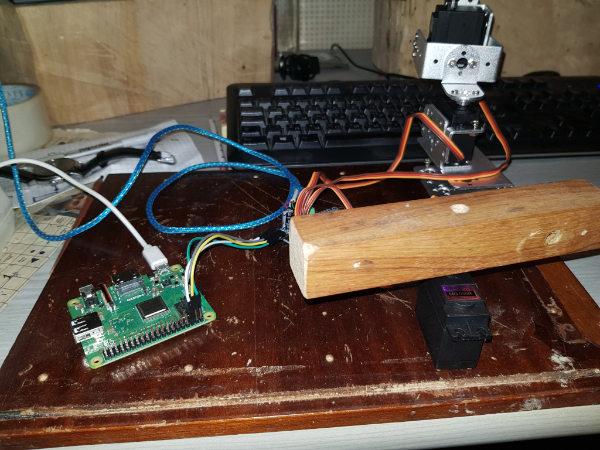
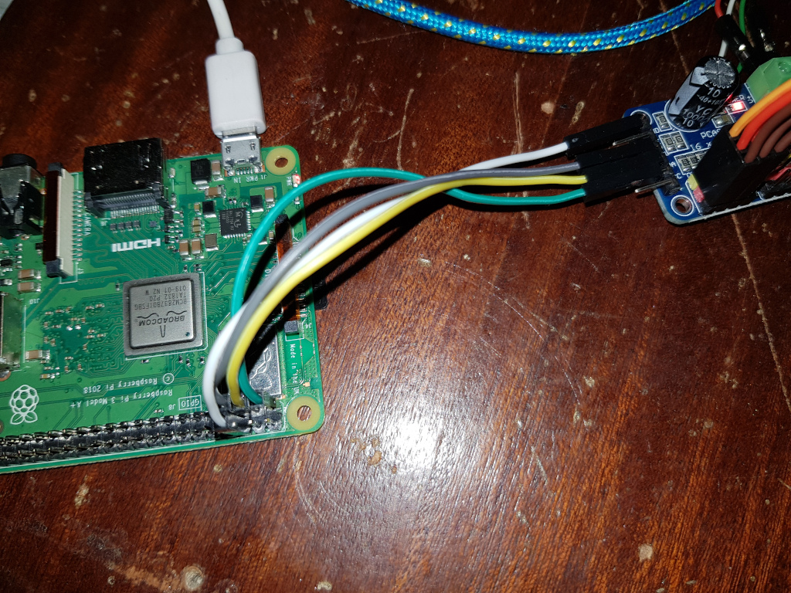

##### Raspberry 3B+ and servo motors setup and few tests

Used:
 - Servo motors:  MG 996R  
 - Controller with PCA9685 chip

Pi config:
 - install libs  
  `sudo apt-get install i2c-tools python-smbus` 
 - enable i2c  
   `/etc/modules`  
   add line  
   `i2c-dev`
   
 - add line in  
   `boot/config.txt`  
   `dtparam=i2c_arm=on`
 
 Wiring
   - 1 - VCC
   - 2 - SDA
   - 3 - SCL
   - GND - GND  
  similar to:  
   
   
 Code here `test-samples/servo/`  
 
 Overall pictures: 
    
   
 
Video:   
 https://www.youtube.com/watch?v=E5VS4s-R7vk
