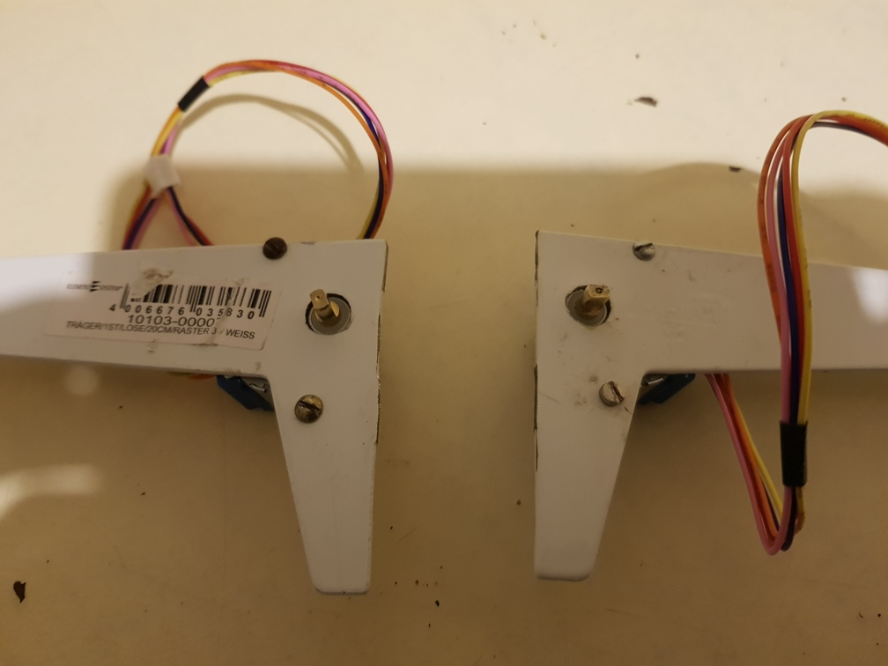
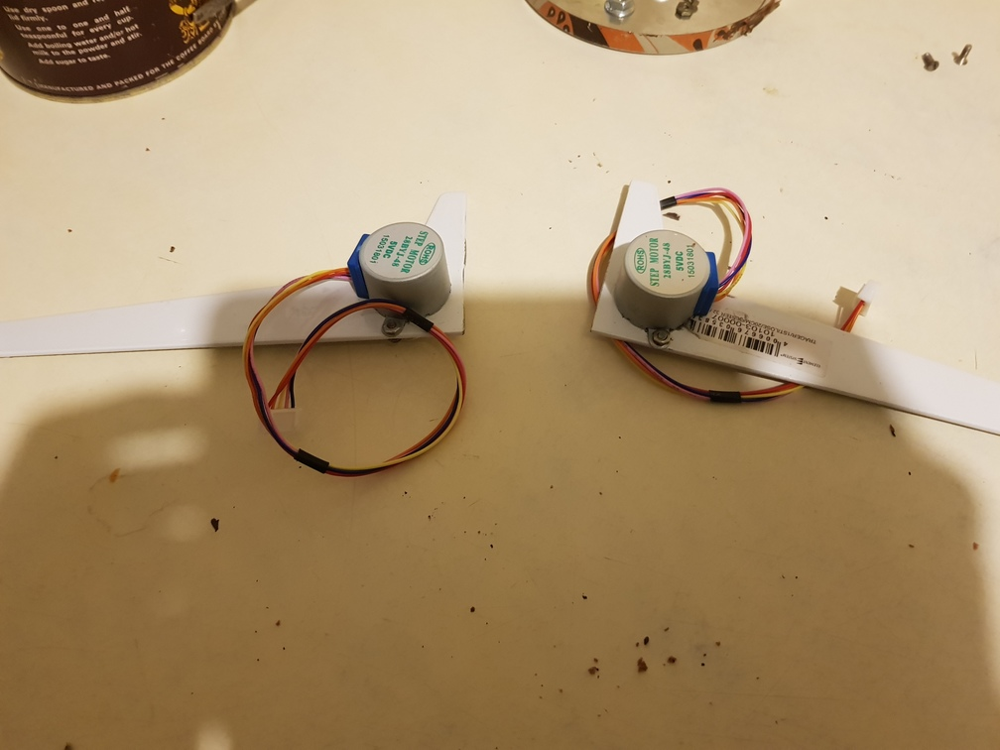
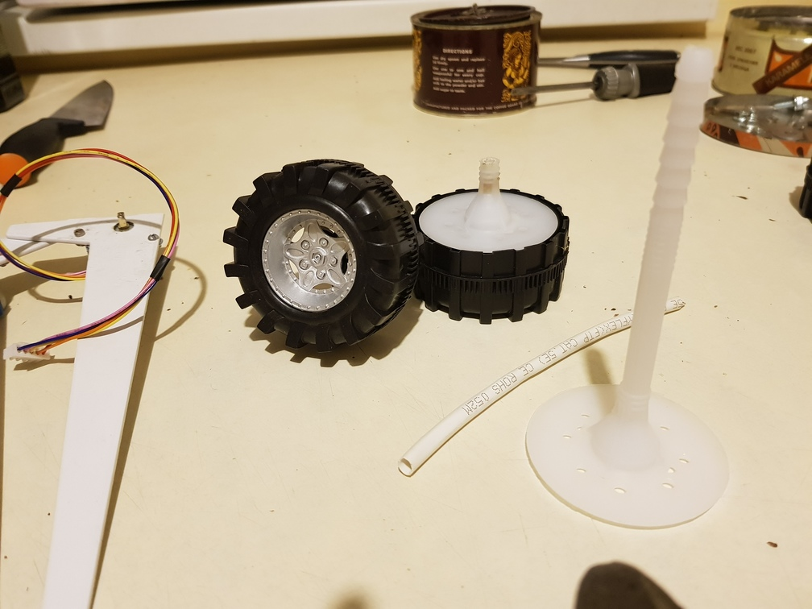
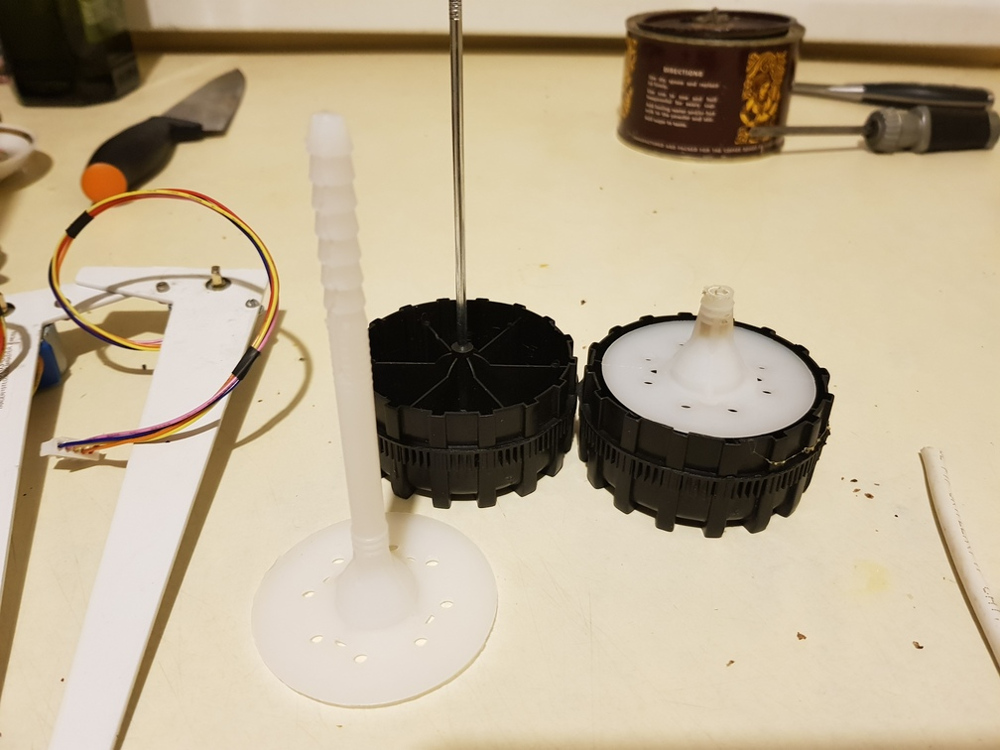
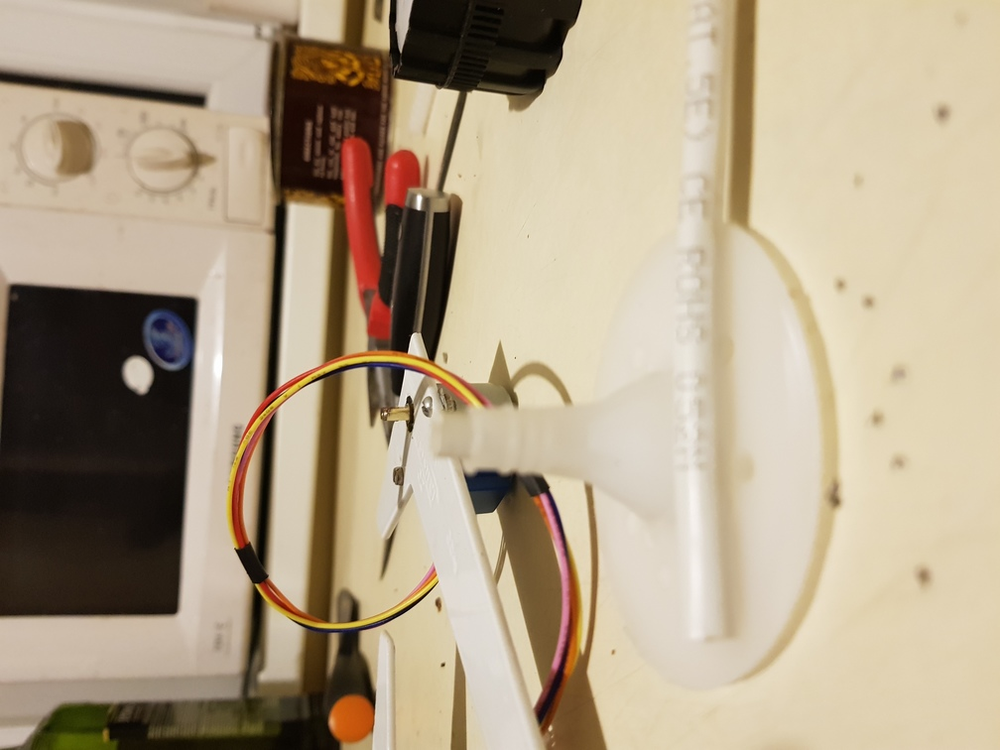
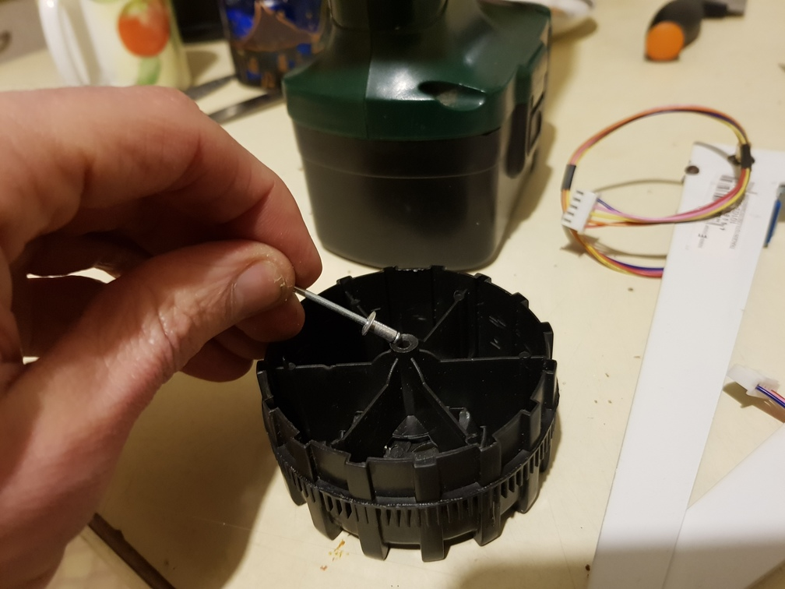
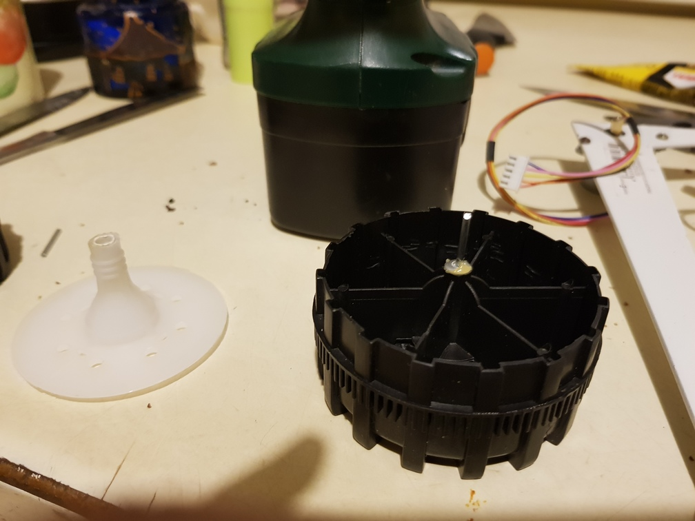
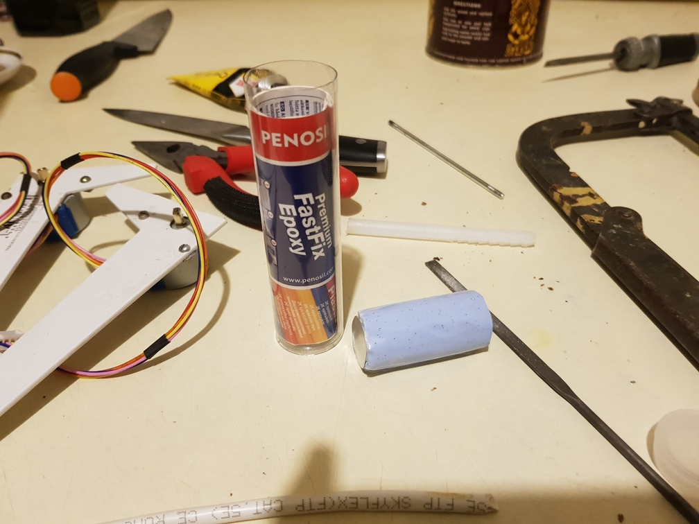
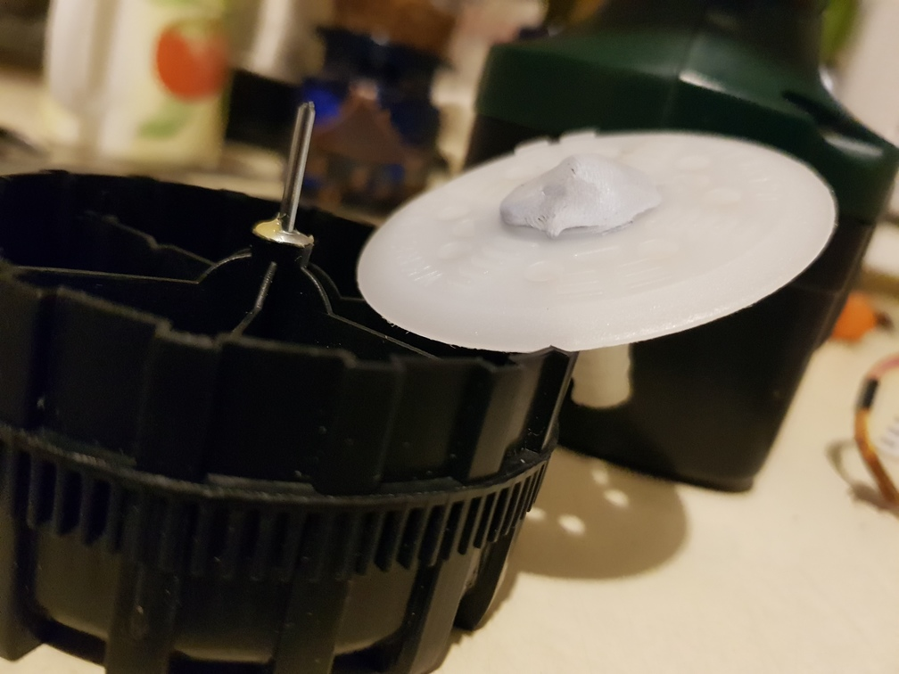
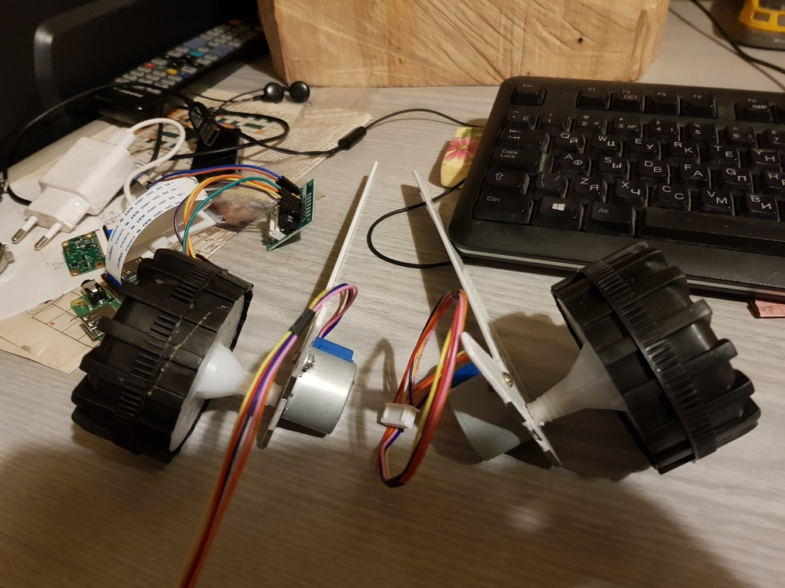

Bought:
 - 2 servo motors 28BYJ-48
 - cheap toy car ~5eur
 - metal wall racks
 - 2 plastic dowels for walls  

1. drilled holes (3mm) and put screws to secure motor, have to file large hole a bit to fit motor in 9.1mm hole
also need to have 2 screws, as with 1 and glue it did not fix very well.
   
 

2. preparing wheel, motor shaft was a bit smaller as diameter of dowel, so put isolation inside to center better.
   
   
 
 and glue it with moment fix glue

3. to center wheel in plastic dowel I used rivet - in this case 3mm one
   
  glue it in with Moment Fix
   

4. Fixing wheel to dowel with epoxy glue
   
   
   

5. Other side also filled with same epoxy glue and pressed in motor, cleaned up to be sure motor can rotated after hardening.
 Run motor to ensure that no glue is between motor itself and wheel, only shaft is glued.
